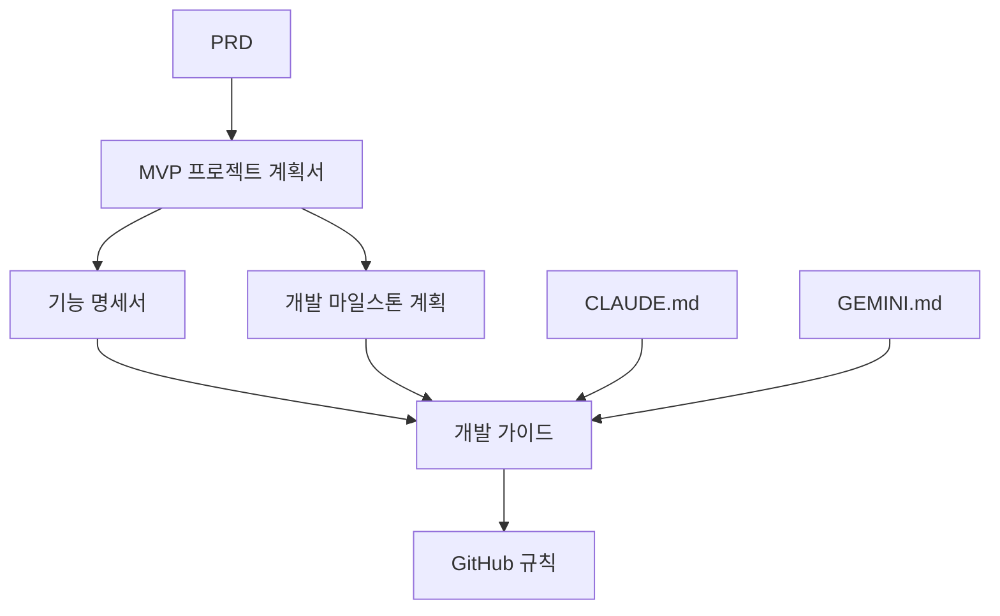

# K-map: 생물학 데이터 포털

한국인 인체 생물학 데이터를 제공하는 혁신적인 데이터 포털 MVP 프로젝트입니다.

## 🎯 프로젝트 개요

- **프로젝트명**: K-map
- **목표**: 생물학 데이터의 접근성 향상 및 최적화된 시각화 경험 제공
- **기술 스택**: React.js + FastAPI + PostgreSQL + Docker
- **개발 기간**: 4주 (MVP)

## 🏗️ 아키텍처

```
k-map-mvp/
├── backend/                 # FastAPI 백엔드
│   ├── app/
│   │   ├── api/            # API 라우터
│   │   ├── core/           # 설정 및 데이터베이스
│   │   ├── models/         # SQLAlchemy 모델
│   │   └── schemas/        # Pydantic 스키마
│   ├── Dockerfile
│   └── requirements.txt
├── frontend/               # React 프론트엔드
│   ├── src/
│   │   ├── components/     # 재사용 컴포넌트
│   │   ├── pages/          # 페이지 컴포넌트
│   │   ├── services/       # API 통신
│   │   └── types/          # TypeScript 타입
│   ├── Dockerfile
│   └── package.json
└── docker-compose.yml      # 개발환경 오케스트레이션
```

## 🚀 빠른 시작

### 필수 요구사항

- Docker & Docker Compose
- Git

### 개발 환경 실행

1. **프로젝트 클론**
```bash
git clone <repository-url>
cd k-map-mvp
```

2. **환경변수 설정**
```bash
cp backend/.env.example backend/.env
cp frontend/.env.example frontend/.env
```

3. **전체 스택 실행**
```bash
docker compose up
```

4. **개별 서비스 실행**
```bash
# 프론트엔드만 실행
docker compose up frontend

# 백엔드만 실행
docker compose up backend db

# 데이터베이스만 실행
docker compose up db
```

### 접속 URL

- **프론트엔드**: http://localhost:3000
- **백엔드 API**: http://localhost:8000
- **API 문서**: http://localhost:8000/docs
- **PostgreSQL**: localhost:5432

## 📋 주요 기능

### 사용자 기능
- **데이터셋 페이지**: 목록 조회, 필터링, 검색, 다운로드
- **시각화 페이지**: UMAP, 히트맵, 박스플롯 등 인터랙티브 차트
- **반응형 웹디자인**: 모바일/데스크톱 최적화

### 관리자 기능
- **인증 시스템**: 관리자 로그인
- **데이터 관리**: 업로드, 수정, 삭제 (CRUD)
- **파일 업로드**: .csv, .json, .h5ad 형식 지원

## 🛠️ 기술 스택

### Backend
- **FastAPI**: 고성능 Python 웹 프레임워크
- **SQLAlchemy**: ORM 및 데이터베이스 추상화
- **PostgreSQL**: 관계형 데이터베이스
- **Pydantic**: 데이터 검증 및 직렬화
- **Plotly**: 백엔드 시각화 데이터 생성

### Frontend
- **React 18**: 최신 React + Hooks
- **TypeScript**: 타입 안전성
- **React Router**: 클라이언트 사이드 라우팅
- **Plotly.js**: 인터랙티브 데이터 시각화
- **Axios**: HTTP 클라이언트

### Infrastructure
- **Docker**: 컨테이너화
- **Docker Compose**: 멀티 컨테이너 오케스트레이션

## 🎨 UI/UX 특징

- **직관적인 인터페이스**: 연구자 친화적 디자인
- **반응형 레이아웃**: 모든 디바이스 지원
- **인터랙티브 시각화**: 확대/축소, 패닝, 호버 기능
- **빠른 로딩**: 최적화된 성능

## 📝 개발 가이드

### 코딩 컨벤션

**Backend (Python)**
- PEP 8 준수
- 타입 힌트 필수 사용
- Ruff를 통한 포매팅 및 린팅

**Frontend (TypeScript/React)**
- 함수형 컴포넌트 + Hooks 사용
- PascalCase (컴포넌트), camelCase (변수/함수)
- ESLint + Prettier 적용

### API 설계

RESTful API 설계 원칙을 따르며, 다음과 같은 주요 엔드포인트를 제공합니다:

```
GET    /api/v1/datasets              # 데이터셋 목록
GET    /api/v1/datasets/{id}         # 데이터셋 상세
GET    /api/v1/visualizations/umap   # UMAP 시각화
POST   /api/v1/admin/login           # 관리자 로그인
POST   /api/v1/admin/datasets        # 데이터셋 생성
```

## 🔒 보안

- JWT 기반 관리자 인증
- CORS 설정으로 안전한 크로스 오리진 요청
- 환경변수를 통한 민감정보 관리
- SQL Injection 방지 (SQLAlchemy ORM)

## 📊 성능 최적화

- **Backend**: 비동기 처리 (FastAPI)
- **Frontend**: 코드 스플리팅, 레이지 로딩
- **Database**: 인덱싱 및 쿼리 최적화
- **Caching**: 시각화 데이터 캐싱

## 🧪 테스트

```bash
# 백엔드 테스트
cd backend
pytest

# 프론트엔드 테스트
cd frontend
npm test
```

## 📚 프로젝트 문서

프로젝트와 관련된 모든 문서는 아래에서 확인할 수 있습니다:

### 📋 기획 및 명세 문서
- **[PRD (Product Requirements Document)](./PRD.md)**: 제품 요구사항 정의서 - 프로젝트의 전체적인 요구사항과 목표를 상세히 정의
- **[MVP 프로젝트 계획서](./MVP%20프로젝트%20계획서.md)**: 4주간의 MVP 개발 계획과 범위 정의
- **[기능 명세서](./기능%20명세서.md)**: 사용자 기능과 관리자 기능의 상세한 기술 명세
- **[개발 마일스톤 계획](./개발%20마일스톤%20계획.md)**: 주차별 개발 목표와 세부 작업 계획

### 🛠️ 개발 가이드
- **[개발 가이드](./개발_가이드.md)**: 프로젝트 환경 설정, 코딩 컨벤션, API 설계 등 개발 관련 종합 가이드
- **[GitHub 규칙](./github_규칙.md)**: Git 브랜치 전략, PR 규칙, 코드 리뷰 가이드라인

### 🤖 AI 도구 활용
- **[CLAUDE.md](./CLAUDE.md)**: Claude AI를 활용한 개발 가이드 및 프로젝트 컨텍스트
- **[GEMINI.md](./GEMINI.md)**: Gemini AI 활용 방법 및 명령어 가이드

### 문서 구조 및 관계도



### 📖 문서별 핵심 내용

| 문서명 | 주요 내용 | 대상 독자 |
|--------|----------|-----------|
| PRD | 비즈니스 요구사항, 사용자 스토리 | PM, 기획자, 개발자 |
| MVP 프로젝트 계획서 | 프로젝트 범위, 일정, 기술 스택 | 전체 팀 |
| 기능 명세서 | API 명세, 데이터 모델, UI 상세 | 개발자 |
| 개발 마일스톤 계획 | 주차별 작업 계획, 우선순위 | 프로젝트 매니저, 개발자 |
| 개발 가이드 | 환경 설정, 코딩 규칙, 테스트 | 개발자 |
| GitHub 규칙 | 협업 규칙, 브랜치 전략 | 개발자 |
| CLAUDE.md | AI 페어 프로그래밍 가이드 | 개발자 |
| GEMINI.md | AI 도구 활용법 | 개발자 |


---

**Demo 계정 정보:**
- 관리자 계정: `admin` / `admin123`